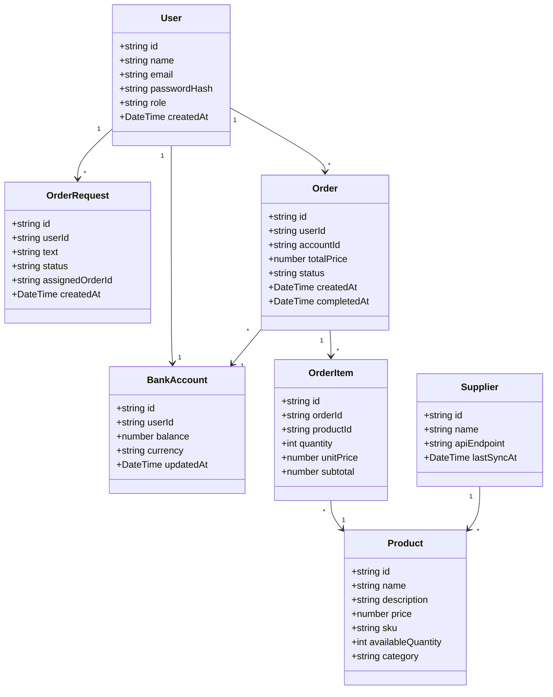

# Application data model

## Plain English explanation

This app needs to remember who is using it, what they can buy, and what they have ordered.

- `User` represents a buyer who logs in and works with the app.
- `BankAccount` stores the buyer's assigned budget and current balance.
- `Product` is each catalogue item the simulated supplier offers.
- `Supplier` represents the external catalogue source or supplier API that provides the product list.
- `OrderRequest` captures the natural language order text the user or agent submits and tracks whether it was fulfilled.
- `Order` is the actual purchase transaction created to fulfill a request.
- `OrderItem` breaks an order into one or more product line items, including quantity and price.

Connections:

- A `User` has one `BankAccount` and can place many `Orders`.
- A `User` can also submit many `OrderRequest` texts for the app or agent to fulfill.
- An `Order` is paid from a `BankAccount` and contains many `OrderItem`s.
- Each `OrderItem` points to a `Product` from the catalogue.
- `Supplier` owns or supplies the available `Product`s, representing the external seller interface.

This model keeps the core domain simple while supporting catalogue browsing, budget-aware fulfillment, and natural language order capture.
